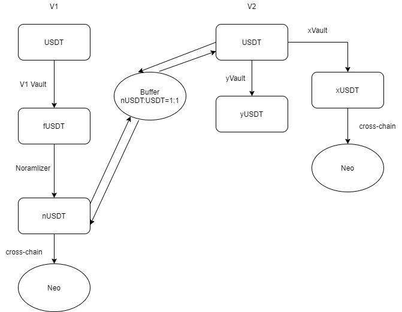

# FIP#2 Flamincome Version 2

### Summary
Based on the previous swapping problem in version 1, we decide to propose a new Flamincome-V2 

### Specification
In Flamincome-V1, users can deposit `USDT` into Vault to mint `fUSDT`，then `fUSDT` can generate `nUSDT` through Normalizer. `nUSDT` can be use to finish Cross-Chain job such as crossing to Neo.

However, there exists some problem that users can't swap their `nUSDT` back to `USDT` if they don not follow the swapping flow describe above(for example, one using Uniswap to swap `USDT` to `nUSDT`).  

To deal with the logical problem, we decide to design a new Flamincome-V2. Instead of using one single Vault in V1, there will be two Vaults in V2 where one is XVault and the other is YVault responsible for different functions. Users can deposit `USDT` into either XVault or YVault as they want. If users choose XVault which will generate Xtoken, they can perform cross-chain function to Neo and get rewards but can not withdraw any rewards in Ethereum. If depositing into YVault, users can get rewards in Ethereum minted by both XVault and YVault but can not perform cross-chain operations. 

To help users transfer funds from V1 to V2, we provide different options. If the ntokens are generated through the strict V1 process, users can directly swap back to original token. if not, then users can choose the way described below(using `WETH` as an example):
swap the `nWETH` straightly back to `WETH`. We provide a buffer between V1 and V2. Currently we have transfer all deposit funds to V2 Vault, so users can swap back to `WETH` from the buffer in a 1:1 ratio.

Currently we only support the over version swapping on `WETH`. The swapping of `USDT` and `WBTC` will be opened after stabilization. 

xtoken can be withdrew for XVault without any rewards. In order to prevent frequent malicious withdrawal, there will be few withdrawal fees.

ytoken can be withdrew for YVault with the rewards from XVault and YVault.The actual amount received is the amount after deducting the strategy commission and withdrawal fees.

### For
Agree with the new Flamincome-V2 model and Support the launch of V2. 

### Against
Disagree with the new logic in V2 and refuse the version updating.

### Proposer
0xD4e599e0694612553D2B259Dbdc83eb9c4EF47DC

Link: 
https://client.aragon.org/#/flamincome/0x24d840dbaa0c0c72589c8f8860063024d1c064db/

